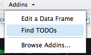
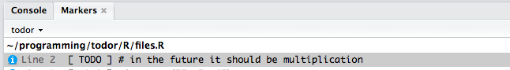

# TODOr

This is a RStudio addin that finds all **TODO**, **FIXME**, **CHANGED** etc. comments in your **project** or **package** and shows them as a markers list.

# Installation

```
devtools::install_github("dokato/todor")
```

# How to use it?

When you write an R package, sometimes it's useful to note in comments that there is a place for improvement.

```r
simple_function <- function(a, b) {
  # TODO in the future it should be multiplication
  a + b
}
```

With **TODOr**, detecting such places in the forest of code lines is simple. There are several options to do so. You can click at "Addins" button in the top panel and select *"Find package TODOs"* or *"Find project TODOs"*) from the list of possible options:



It is also possible to call `todor` directly from RStudio console:

```r
> todor::todor()
```

or you can call:

```r
> todor::todor(c("TODO"))
```

to limit `todor` detection only to `"TODO"` tags.

**HINT:** By default `todor` works on projects, but you can call `todor_package` to search an entire package.

Regardless of the option that you have chosen, as a result you should see the Markers tab next to your console window in RStudio.



To perform the search on a single file just call:

```r
todor_file("path_to_file.R")
```

# What can it detect?

By default *TODOr* looks for the following notes:

- _FIXME_
- _TODO_
- _CHANGED_
- _IDEA_
- _HACK_
- _NOTE_
- _REVIEW_
- _BUG_
- _QUESTION_
- _COMBAK_
- _TEMP_
